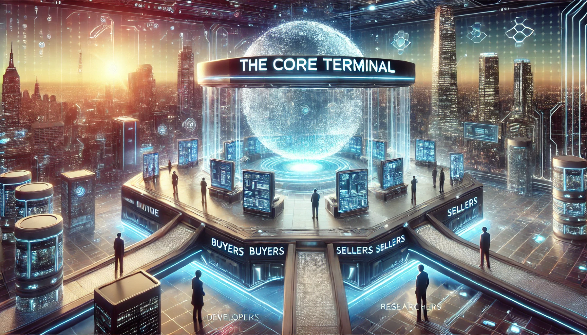

# The Core Terminal solutions

<figure><figcaption></figcaption></figure>

Addressing these challenges requires a transformative approach that bridges the gap between supply and demand in the AI marketplace. A decentralized platform leveraging blockchain technology, such as The Core Terminal, offers a promising solution. By creating a secure and transparent marketplace, The Core Terminal enables the efficient exchange of AI models and computing resources.

**The Role of Decentralized Marketplaces**

Decentralized marketplaces provide a platform where AI models can be accessed and utilized by a broader audience. Researchers and developers can list their models on the marketplace, ensuring they reach those who need them most. This not only maximizes the utility of existing models but also fosters an environment of continuous improvement and innovation. Furthermore, the marketplace allows for transparent transactions, ensuring that all parties involved can trust the integrity of the exchange.

For organizations with surplus computing resources, decentralized marketplaces offer an opportunity to monetize these assets. By lending their unused resources, organizations can generate additional revenue while contributing to the broader AI ecosystem. Simultaneously, businesses in need of affordable computing power can access these resources at competitive rates, leveling the playing field and enabling more wide spread adoption of AI technologies.
